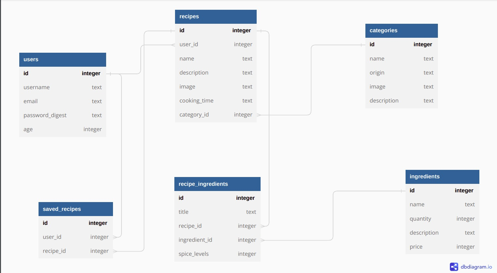

# README
## Recipe App
This
 is a recipe sharing platform built using React for the front-end and
rails for the back-end API. The platform allows users to view and search
 for recipes, add their own recipes, and save recipes to their profile.
The platform has authentication functionality to ensure user privacy,
and the backend supports various API endpoints to enable the frontend to
 function as a SPA.

  

## Features
    User authentication: Sign up, log in, log out, and forgot password functionality.
    Recipe list: View and search for recipes.
    Recipe detail: View a recipe's details, including ingredients and instructions.
    Add recipe: Add a recipe to the platform.
    Edit recipe: Edit a recipe that you have added to the platform.
    User profile: View your user profile, including your saved recipes.
    Saved recipes: View recipes that you have saved.
    My recipes: View recipes that you have added to the platform.
## Getting Started
    Clone the repository to your local machine: git clone https://github.com/kenneymoh/Recipe-App
    Install dependencies for both the front-end and back-end:
        For the front-end: cd client && npm install
        For the back-end: cd server && bundle install
    Set up environment variables:
        For
 the front-end: Copy the .env.example file and rename it to .env. Set
the REACT_APP_API_BASE_URL variable to the base URL of your back-end
API.
        For the back-end: Copy the .env.example file and rename
it to .env. Set the PORT variable to the port number you want the server
 to listen on, and set the DATABASE_URL variable to the URL of your
PostgreSQL database.
    Start the development server:
        For the front-end: cd client && npm start
        For the back-end: cd server && rails s
## API Documentation
The back-end API documentation is available at /api-docs. You can access it by starting the development server and visiting http://localhost:PORT/api-docs in your browser, where PORT is the port number you set in your environment variables.
## Technologies Used
    -React for the front-end
    -rails for the backend
    -Tailwind for the css
## Contributing
Contributions to this project are welcome! If you would like to contribute, please follow these steps:
    -Fork this repository
    -Create a new branch for your feature or bug fix: git checkout -b feature-or-bug-fix
    -Make your changes and commit them with descriptive commit messages
    -Push your changes to your fork: git push origin feature-or-bug-fix
    -Submit a pull request
## Author
- Tracy Mumbi
- Raphael Murangiri
- Phylis Njeri
- Kennedy Maina
## License
This project is licensed under the MIT License.
